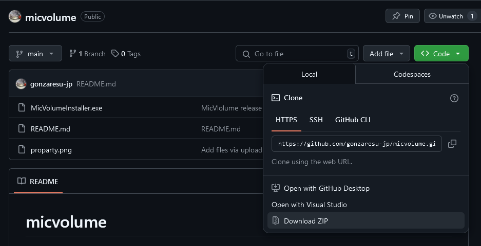
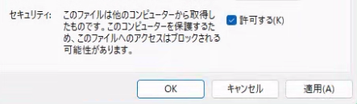

# micvolume

これは、**Windowsがマイク入力のボリュームを勝手に下げてしまう問題**を防ぐためのユーティリティです。

## 🧩 機能

- すべてのマイク入力の音量を100%（最大）に設定します
- Windows 起動時に自動で実行されます
- 10分ごとにも自動で再実行されます（音量が勝手に下がっても補正）

## 📦 インストール方法

1. [<>Code]→[Download ZIP] でダウンロード

2. `MicVolumeInstaller.exe` を実行してください（管理者として実行を推奨）

3. `C:\Program Files\mic\micvolume.exe` がインストールされます

4. タスクスケジューラに2つのタスクが自動登録されます
   - 起動時に実行
   - 10分ごとに実行

署名に使用されている証明書名は `MicVolumeDev` です。

## ⚠ セキュリティ警告について（必ずお読みください）

このツールは**開発者によって自己署名された**実行ファイルを含みます。  
そのため、初回実行時に Windows SmartScreen などから警告が表示される場合があります。

> 実行前に、ファイルを右クリック → [プロパティ] → [許可する] にチェックを行ってください。

署名に使用されている証明書名は `MicVolumeDev` です。

## ❌ アンインストール方法

1. タスクスケジューラを開き、「SetMicVolume_Start」「SetMicVolume_Hourly」の2つを手動で削除
2. `C:\Program Files\mic\` フォルダを削除
